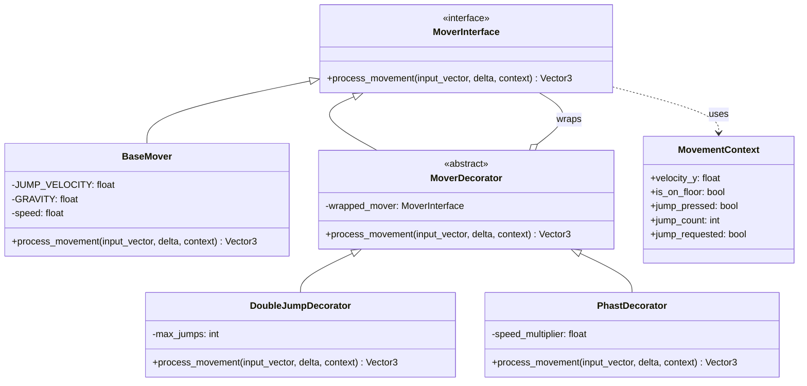
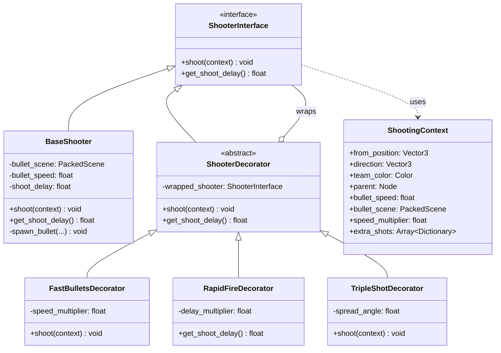

# Decorator Pattern Architecture

## Overview
This document describes the classic decorator pattern implementation for the movement and shooting systems in Epic Footsies 2. This architecture uses the traditional **wrapping pattern** where decorators wrap and enhance base functionality while implementing the same interface.

## Key Design Decisions

### Naming for Semantic Clarity

The primary semantic issue with decorator patterns is that decorators and concrete implementations both implement the same interface, but serve different purposes. We address this through clear, descriptive naming:

| Component | Name | Role | Why This Name |
|-----------|------|------|---------------|
| **Interface** | `MoverInterface` / `ShooterInterface` | Abstract contract | Standard interface naming convention |
| **Base Implementation** | `BaseMover` / `BaseShooter` | Core implementation | Standard base class naming convention |
| **Abstract Decorator** | `MoverDecorator` / `ShooterDecorator` | Wraps another Mover/Shooter | Explicitly labeled as decorator |
| **Concrete Decorators** | `PhastDecorator`, `TripleShotDecorator`, etc. | Wraps and enhances | Clear they're decorators |

**Key principle:** Standard technical naming. `BaseMover` and `BaseShooter` are the core implementations that decorators extend.

## Movement System



## Shooting System



## The Decorator Pattern

### Classic Structure

```gdscript
# Interface
class MoverInterface:
    func process_movement(...) -> Vector3

# Base implementation
class BaseMover extends MoverInterface:
    func process_movement(...) -> Vector3:
        # Actually applies physics

# Abstract decorator
class MoverDecorator extends MoverInterface:
    var wrapped_mover: MoverInterface
    func process_movement(...) -> Vector3:
        return wrapped_mover.process_movement(...)

# Concrete decorator
class PhastDecorator extends MoverDecorator:
    func process_movement(...) -> Vector3:
        var velocity = wrapped_mover.process_movement(...)
        velocity.x *= speed_multiplier  # Enhance!
        return velocity
```

### Wrapping Chain

Decorators wrap each other in layers:

```gdscript
# Build the chain
var mover = BaseMover.new()
mover = DoubleJumpDecorator.new(mover)
mover = PhastDecorator.new(mover)

# Results in: PhastDecorator -> DoubleJumpDecorator -> BaseMover
# Call flows through all layers
mover.process_movement(...)
```

## Processing Capabilities

The decorator pattern supports multiple processing strategies:

### 1. Pre-Processing (Before Delegation)
```gdscript
func process_movement(input, delta, context) -> Vector3:
    context.jump_requested = true  # Modify context
    return wrapped_mover.process_movement(input, delta, context)  # Then delegate
```
**Example:** `DoubleJumpDecorator` sets jump_requested before calling the wrapped mover (ultimately `BaseMover`).

### 2. Post-Processing (After Delegation)
```gdscript
func process_movement(input, delta, context) -> Vector3:
    var velocity = wrapped_mover.process_movement(input, delta, context)  # Delegate first
    velocity.x *= speed_multiplier  # Modify result
    return velocity
```
**Example:** `PhastDecorator` multiplies the returned velocity.

### 3. Conditional Prevention
```gdscript
func shoot(context) -> void:
    if ammo <= 0:
        return  # Don't delegate!
    wrapped_shooter.shoot(context)
```
**Use case:** Ammo systems, cooldowns, condition checks.

### 4. Side Effects
```gdscript
func shoot(context) -> void:
    wrapped_shooter.shoot(context)
    play_sound_effect()  # Do something after
    apply_knockback()
```
**Use case:** Audio, particles, knockback, screen shake.

### 5. Multiple Calls
```gdscript
func shoot(context) -> void:
    for i in range(3):
        wrapped_shooter.shoot(context)  # Call wrapped multiple times
```
**Use case:** Burst fire, scatter shots.

### 6. Result Inspection
```gdscript
func get_shoot_delay() -> float:
    return wrapped_shooter.get_shoot_delay() * delay_multiplier  # Modify return value
```
**Example:** `RapidFireDecorator` reduces the delay.

## Current Decorator Implementations

### Movement Decorators

**DoubleJumpDecorator** (Pre-processing)
- Sets `context.jump_requested = true` when mid-air jump is valid
- Delegates to wrapped mover
- The wrapped mover reads the modified context

**PhastDecorator** (Post-processing)
- Delegates to wrapped mover first
- Multiplies `velocity.x` by `speed_multiplier`
- Returns modified velocity

### Shooting Decorators

**TripleShotDecorator** (Pre-processing)
- Adds left and right directions to `context.extra_shots`
- Delegates to wrapped shooter
- Wrapped shooter reads extra_shots and spawns them

**FastBulletsDecorator** (Pre-processing)
- Multiplies `context.speed_multiplier`
- Delegates to wrapped shooter
- Wrapped shooter uses the multiplier

**RapidFireDecorator** (Post-processing of method call)
- Overrides `get_shoot_delay()`
- Returns `wrapped_shooter.get_shoot_delay() * delay_multiplier`
- Doesn't modify `shoot()` at all

## Player Integration

The Player builds and manages decorator chains:

```gdscript
# Initial setup
base_mover = BaseMover.new()
mover = base_mover

base_shooter = BaseShooter.new()
shooter = base_shooter

# When powerup is applied
func apply_powerup(name):
    mover_decorator_names.append(name)
    _rebuild_movement_chain()

# Rebuild chain
func _rebuild_movement_chain():
    mover = base_mover
    for name in mover_decorator_names:
        mover = registry.create_movement_decorator(name, mover)
    # Result: mover = Decorator3(Decorator2(Decorator1(BaseMover)))
```

### Usage

```gdscript
# Player just calls the outermost decorator
velocity = mover.process_movement(input, delta, context)

# Which flows through:
# PhastDecorator.process_movement()
#   -> DoubleJumpDecorator.process_movement()
#     -> BaseMover.process_movement()
#   <- returns velocity
# <- multiplies velocity.x
```

## Context Objects

Contexts are data transfer objects that pass state through the decorator chain.

### MovementContext
- **Input state:** `velocity_y`, `is_on_floor`, `jump_pressed`, `jump_count`
- **Decorator communication:** `jump_requested` (set by decorators, read by `BaseMover`)
- **Output state:** `jump_count` (modified during processing, read by Player)

### ShootingContext
- **Input state:** `from_position`, `direction`, `team_color`, `parent`
- **Decorator communication:** `speed_multiplier`, `extra_shots` (accumulated by decorators)
- **Configuration:** `bullet_scene`, `bullet_speed` (set by `BaseShooter` if needed)

## Design Patterns

This architecture combines:

1. **Decorator Pattern**: Wrapping to add functionality dynamically
2. **Context Object Pattern**: Pass state without parameter proliferation
3. **Chain of Responsibility**: Request flows through decorator chain

## Benefits

### 1. Flexibility
- Pre-processing, post-processing, conditional logic all possible
- Can intercept at any point in the call
- Can prevent execution entirely
- Can run code after execution

### 2. Composability
- Stack multiple decorators
- Order matters for post-processing (outer decorators process after inner)
- Order less important for pre-processing context modifications

### 3. Semantic Clarity (Through Naming)
- `MoverInterface` / `ShooterInterface` - standard interface naming
- `BaseMover` / `BaseShooter` - standard base implementation naming
- `MoverDecorator` / `ShooterDecorator` - explicitly wrappers
- No ambiguity about roles

### 4. Extensibility
- Add new decorators without modifying existing code
- Each decorator is independent
- Easy to enable/disable specific behaviors

## Order Dependence

Decorator order matters for post-processing:

```gdscript
# Order 1
var m = BaseMover.new()      # speed = 5.0
m = PhastDecorator.new(m)    # velocity.x *= 1.6 -> becomes 8.0
m = PhastDecorator.new(m)    # velocity.x *= 1.6 -> becomes 12.8

# Order 2
var m = BaseMover.new()
m = PhastDecorator.new(m)
m = PhastDecorator.new(m)
# Same result! Multiplication is commutative

# But for non-commutative operations:
var m = BaseMover.new()
m = IceDecorator.new(m)      # Interpolates with previous velocity
m = PhastDecorator.new(m)    # Multiplies speed
# vs
m = PhastDecorator.new(m)    # Multiplies first
m = IceDecorator.new(m)      # Then interpolates
# Different results!
```

## Adding New Decorators

### Movement Decorator Example

```gdscript
class_name WallRunDecorator
extends MoverDecorator

func process_movement(input, delta, context) -> Vector3:
    var velocity = wrapped_mover.process_movement(input, delta, context)

    # Post-process: slow fall if on wall
    if player.is_on_wall() and not context.is_on_floor:
        velocity.y = max(velocity.y, -2.0)

    return velocity
```

### Shooting Decorator Example

```gdscript
class_name RecoilDecorator
extends ShooterDecorator

func shoot(context) -> void:
    wrapped_shooter.shoot(context)
    # Side effect after shooting
    player.apply_knockback(-context.direction * 5.0)
```

### Conditional Execution Example

```gdscript
class_name AmmoDecorator
extends ShooterDecorator

var ammo: int = 10

func shoot(context) -> void:
    if ammo <= 0:
        play_empty_sound()
        return  # Prevent shooting!

    ammo -= 1
    wrapped_shooter.shoot(context)
```

## Comparison: Why Not the Modify-Then-Execute Pattern?

We previously tried a simpler pattern where:
- Decorators only had `modify(context)` method
- Player manually applied all modifiers, then called executor

**That pattern was simpler but less flexible:**
- ❌ Can't post-process return values
- ❌ Can't run code after execution
- ❌ Can't conditionally prevent execution
- ❌ Can't wrap/intercept behavior
- ✅ Easier to understand
- ✅ More explicit flow

**Classic decorator pattern (current):**
- ✅ Full control of call chain
- ✅ Pre and post-processing
- ✅ Conditional execution
- ✅ Side effects at any point
- ❌ More complex
- ❌ Nested chain harder to debug

**Verdict:** Classic decorator pattern provides the flexibility needed for complex powerups (ammo, recoil, wall-run, etc.) at the cost of some complexity.

## File Structure

```
scripts/
├── movement/
│   ├── mover_interface.gd            # Interface
│   ├── base_mover.gd                 # Base implementation
│   ├── movement_decorator.gd         # Abstract decorator
│   ├── movement_context.gd           # Context object
│   └── decorators/
│       ├── double_jump_decorator.gd
│       └── phast_decorator.gd
└── shooting/
    ├── shooter_interface.gd          # Interface
    ├── base_shooter.gd               # Base implementation
    ├── shooter_decorator.gd          # Abstract decorator
    ├── shooting_context.gd           # Context object
    └── decorators/
        ├── fast_bullets_decorator.gd
        ├── rapid_fire_decorator.gd
        └── triple_shot_decorator.gd
```

## Summary

This architecture uses the classic Decorator pattern with:
- **Technical naming** (`*Interface`, `Base*`, `*Decorator`) for clear role identification
- **Wrapping** to enable maximum flexibility
- **Context objects** for communication through the chain
- **Player orchestration** to build and manage decorator chains

The naming convention (`MoverInterface`, `BaseMover`, `ShooterInterface`, `BaseShooter`) follows standard technical conventions, making the component roles immediately clear while retaining the decorator pattern's power.
