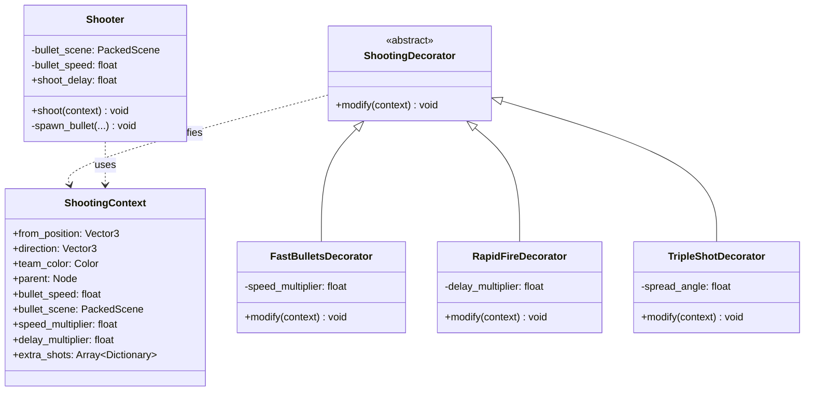

# Decorator Pattern Architecture

## Overview
This document describes the decorator pattern implementation for the movement and shooting systems in Epic Footsies 2. This architecture separates **modification logic** (what decorators do) from **execution logic** (what the core systems do), providing clear semantic separation.

## Movement System


## Shooting System



## Player Orchestration


## Semantic Analysis

### Why This Architecture?

The previous decorator pattern had a semantic issue: both decorators and implementations had the same interface (`shoot()`, `process_movement()`), but they did fundamentally different things:
- **Implementations** actually performed actions (spawned bullets, applied physics)
- **Decorators** just modified context and passed through

This created confusion: "If TripleShotDecorator is a Shooter, why doesn't it shoot?"

### The Solution: Separate Interfaces

**Decorators** and **Executors** now implement different interfaces:

| Component | Interface | Purpose | Semantic Clarity |
|-----------|-----------|---------|------------------|
| **Mover** | `process_movement()` | Actually processes movement with physics | ✅ Clear - it moves things |
| **MovementDecorator** | `modify(context)` | Modifies movement parameters | ✅ Clear - it modifies |
| **Shooter** | `shoot(context)` | Actually spawns bullets | ✅ Clear - it shoots |
| **ShootingDecorator** | `modify(context)` | Modifies shooting parameters | ✅ Clear - it modifies |

### Naming Conventions

| Old Name | New Name | Rationale |
|----------|----------|-----------|
| `DefaultMover` | `Mover` | Removed "Default" - it's not a fallback, it's the core implementation |
| `DefaultShooter` | `Shooter` | Removed "Default" - it's the only implementation |
| `MoverDecorator` | `MovementDecorator` | Renamed to reflect what it does: modifies movement |
| `ShooterDecorator` | `ShootingDecorator` | Renamed to reflect what it does: modifies shooting |
| `*Decorator` | `*Decorator` | All powerup decorators renamed to decorators |

### Movement Decorators

| Decorator | Purpose | Semantic Accuracy |
|-----------|---------|-------------------|
| **DoubleJumpDecorator** | Enables multiple jumps by setting `jump_requested` flag | ✅ Modifies jump behavior |
| **PhastDecorator** | Increases speed by multiplying `speed_multiplier` | ✅ Modifies speed |

### Shooting Decorators

| Decorator | Purpose | Semantic Accuracy |
|-----------|---------|-------------------|
| **FastBulletsDecorator** | Increases bullet speed via `speed_multiplier` | ✅ Modifies bullet speed |
| **RapidFireDecorator** | Reduces delay via `delay_multiplier` | ✅ Modifies fire rate |
| **TripleShotDecorator** | Adds extra shots to `extra_shots` array | ✅ Modifies shot pattern |

## Design Pattern: Decorator Pattern

This is NOT the classic Decorator pattern. It's a **Decorator pattern** with these characteristics:

1. **Separate Interfaces**: Decorators and executors implement different interfaces
2. **Context Object**: Shared state container for modifications
3. **Orchestrated Execution**: Player coordinates: modify → execute
4. **No Wrapping**: Decorators don't wrap executors; they're separate objects

### Pattern Structure

```gdscript
# In Player
var mover: Mover                              # The executor
var movement_decorators: Array[MovementDecorator]  # The decorators

func _process_movement(delta):
    # 1. Create context
    var context = MovementContext.new(...)

    # 2. Apply all decorators
    for decorator in movement_decorators:
        decorator.modify(context)

    # 3. Execute with modified context
    velocity = mover.process_movement(input, delta, context)
```

## Context Objects

### MovementContext
Acts as a data transfer object that:
- Carries state from Player to Mover (velocity_y, is_on_floor, jump_pressed, jump_count)
- Allows decorators to set flags (jump_requested) and multipliers (speed_multiplier)
- Returns updated state to Player (jump_count)

### ShootingContext
Acts as a data transfer object that:
- Carries shooting parameters (position, direction, team_color)
- Accumulates modifications (speed_multiplier, delay_multiplier, extra_shots)
- Provides configuration to Shooter for bullet spawning

## Implementation Flow

### Movement System
1. **Player** creates `MovementContext` with current state
2. **Each MovementDecorator** modifies the context:
   - `DoubleJumpDecorator`: May set `jump_requested = true`
   - `PhastDecorator`: Multiplies `speed_multiplier`
3. **Mover** processes movement using modified context
4. **Player** receives updated velocity and state

### Shooting System
1. **Player** creates `ShootingContext` with position/direction
2. **Each ShootingDecorator** modifies the context:
   - `TripleShotDecorator`: Adds entries to `extra_shots`
   - `FastBulletsDecorator`: Multiplies `speed_multiplier`
   - `RapidFireDecorator`: Multiplies `delay_multiplier`
3. **Shooter** spawns all bullets based on modified context
4. **Player** sets cooldown using `shooter.shoot_delay * context.delay_multiplier`

## Order Independence

Unlike the decorator pattern, decorator order is **mostly independent**:

### Movement Decorators
- Decorators set independent context fields
- Multiple speed multipliers compound multiplicatively (commutative)
- Jump decorators set boolean flags (order doesn't matter)

### Shooting Decorators
- Each modifies orthogonal context fields
- Speed multipliers compound multiplicatively (commutative)
- Extra shots accumulate in array (order only affects array order, not behavior)
- Delay multipliers compound multiplicatively (commutative)

## Adding New Decorators

### Create a Movement Decorator
```gdscript
class_name MyMovementDecorator
extends MovementDecorator

func modify(context: MovementContext) -> void:
    # Modify context fields as needed
    context.speed_multiplier *= 2.0
```

### Create a Shooting Decorator
```gdscript
class_name MyShootingDecorator
extends ShootingDecorator

func modify(context: ShootingContext) -> void:
    # Modify context fields as needed
    context.speed_multiplier *= 1.5
```

### Register in PowerUpRegistry
```gdscript
var movement_powerups = {
    "my_powerup": MyMovementDecorator,
}
```

## Benefits Over Decorator Pattern

1. **Semantic Clarity**: Decorators modify, executors execute - no ambiguity
2. **Simpler Construction**: No nested wrapping chains to manage
3. **Easy to Inspect**: Array of decorators is easier to debug than nested wrappers
4. **Order Independence**: Most decorators can be applied in any order
5. **Single Responsibility**: Each component has one clear purpose
6. **Explicit Flow**: Player orchestration makes the pipeline obvious
