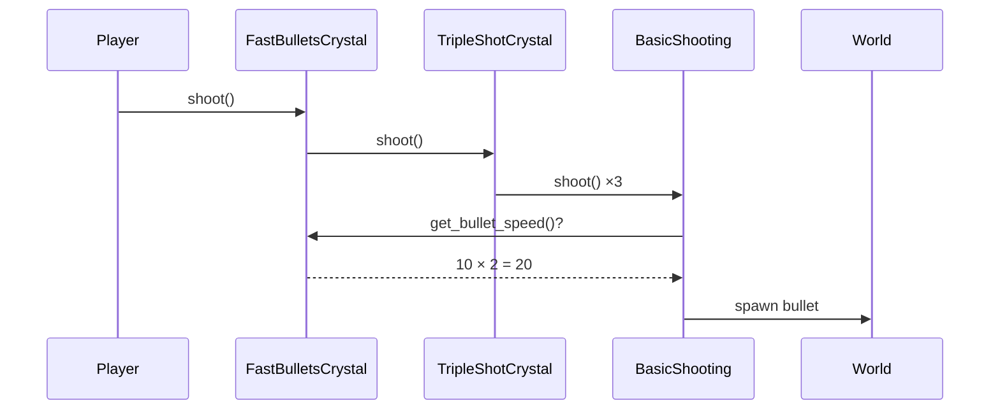

# Crystal (Power Up) Architecture

## File Structure

```
scripts/
  player.gd
  bullet.gd
  movement/
    movement_behavior.gd    ← interface
    basic_movement.gd       ← default
    movement_crystal.gd     ← crystal base
    phast_crystal.gd        ← crystal
  shooting/
    shooting_behavior.gd    ← interface
    basic_shooting.gd       ← default
    shooting_crystal.gd     ← crystal base
    fast_bullets_crystal.gd ← crystal
    triple_shot_crystal.gd  ← crystal
```

## How It Works



## Crystal Lists

Player tracks active crystals in lists:

```gdscript
var movement_crystals: Array[String] = []
var shooting_crystals: Array[String] = []
```

Adding a crystal → append to list → rebuild behavior chain  
Removing a crystal → erase from list → rebuild behavior chain
